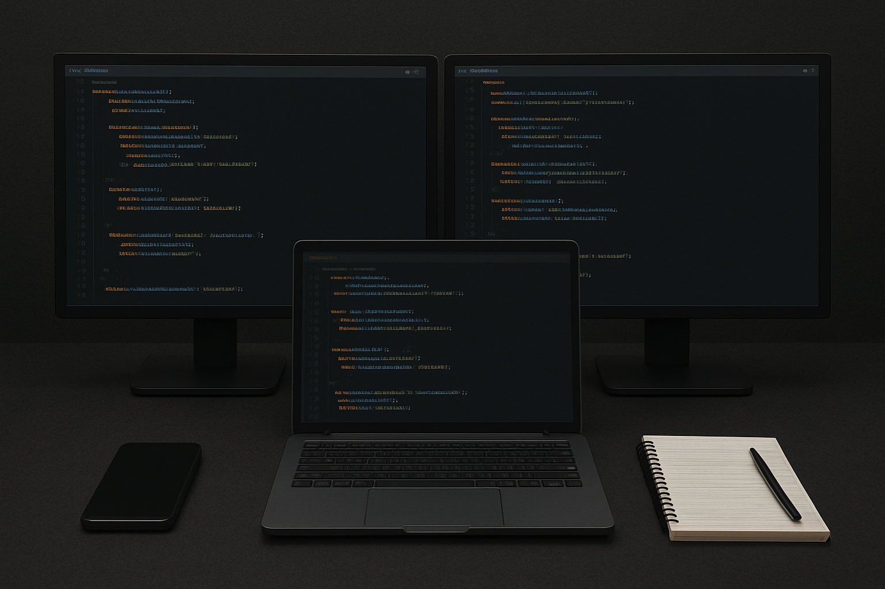

# ⚛️ Welcome to Alex Green's Profile! ⚛️

## 🔧 Frontend Developer & UI/UX Specialist 🔧

|                                                                                                                                                                                                                                                                                                                                                                                                                                                                                                                 |  |
| :---------------------------------------------------------------------------------------------------------------------------------------------------------------------------------------------------------------------------------------------------------------------------------------------------------------------------------------------------------------------------------------------------------------------------------------------------------------------------------------------------------------------------------------------------------------------------- | ------------------------------------------------------------------: |
|     |                                                                     |

## About

Passionate frontend developer with expertise in modern web technologies. Focused on creating clean, efficient, and user-friendly applications with a strong emphasis on performance and accessibility.

## Tech Stack

### Languages & Frameworks

### Tools & Platforms

## Development Principles

-   🎯 **Clean Code** - Writing maintainable and readable code
-   🧪 **Testing** - Comprehensive testing strategies
-   📚 **Documentation** - Clear and thorough documentation
-   🔄 **Continuous Learning** - Staying updated with latest technologies
-   🤝 **Collaboration** - Working effectively in team environments

_Last updated: January 2025_
